<br><br>

<!-- project philosophy -->


> Welcome to Petrix, your go-to AI assistant for all things related to your beloved pets.
>
> With Petrix, we go beyond simple image classification to offer a comprehensive pet care solution. Whether you're an experienced pet owner or a novice, Petrix has you covered.

### User Types 

1. Pet owners 
2. Doctors

### Features of the App 

As a Pet Owner, I want : 

- To Quickly identify the species and breed of my pet by submitting a photo so that I may learn more about them.
- A tool to provide me with real-time health and wellness updates for my pet, including weight check, exercises, and nutritional guidelines, so that I can ensure its overall safety.
- To use my current location to search for local vet clinics and offer a list with important data like the distance, ratings, and contact information, so i can book an appointmen with the best veterinary clinic for the needs of my pet.

As a Doctor, I want to: 

- Have a profile page on the site so pet owners can quickly have an exact location of my clinic, opening hours and any other information. 
- Be notified of appointment requests from pet owners, so i could effectively organize my calendar and provide my clients pets the care they need.
- Review the comments and ratings of clients, so I can have a better assessment of the care we are providing.

<br><br> 
<!-- Prototyping -->


> We designed PETRIX using wireframes and mockups, iterating on the design until we reached the ideal layout for easy navigation and a seamless user experience.

### Mockups
| Login  | Sign up - 1 | Sign up - 2 |
| ---| ---| ---|
| 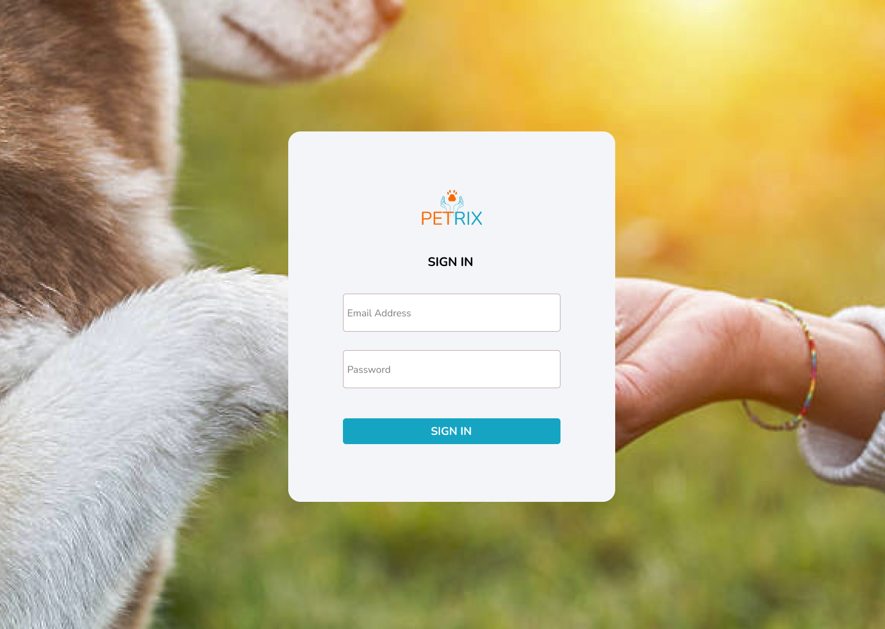 | 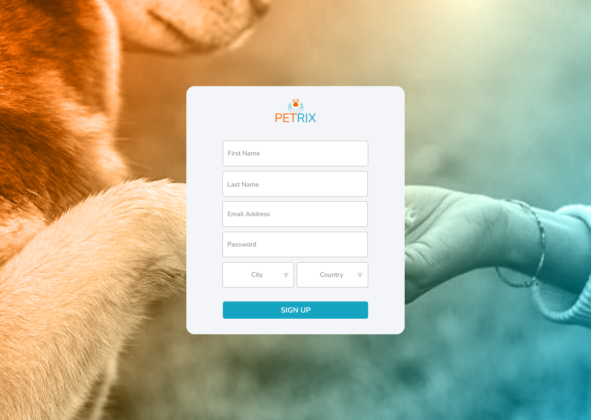 | 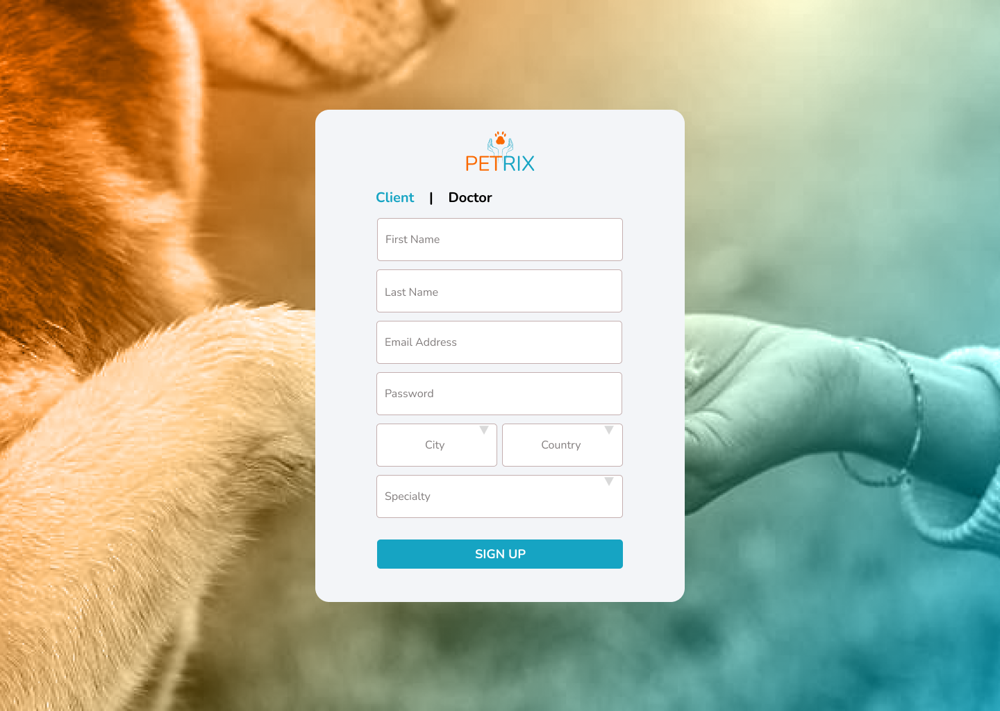 |
|  AI Classification | AI Assistant | Doctors near you |
| 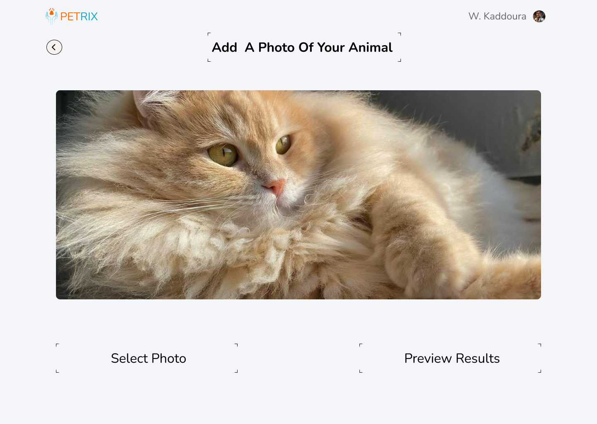 | 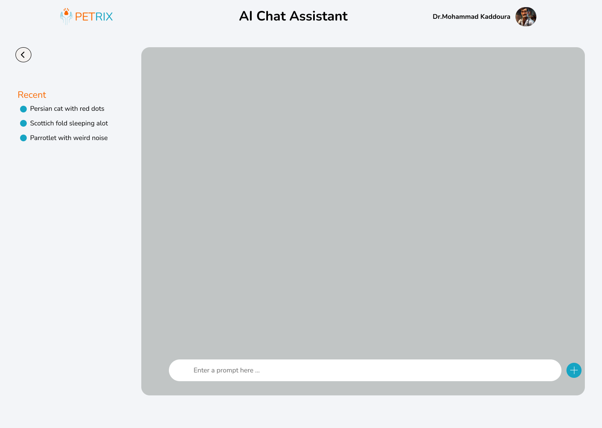 | 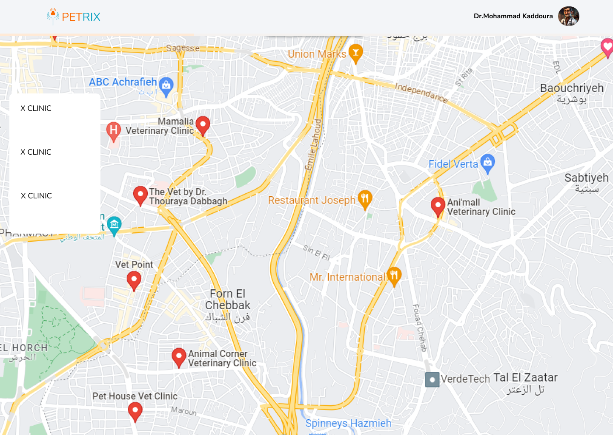 |
| Book Appointment | Handle Appointments | Doctor profile |
| 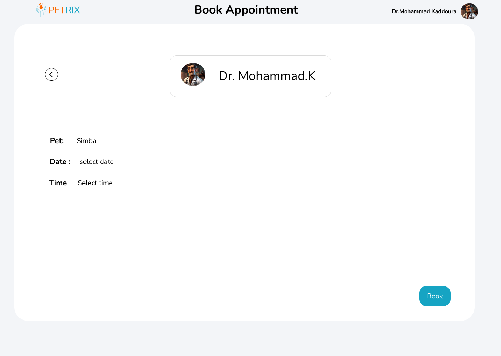 | 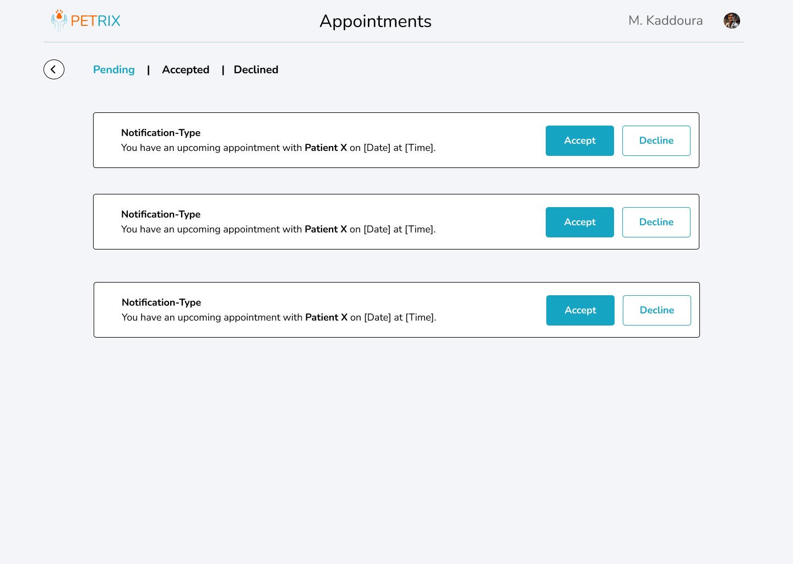 | 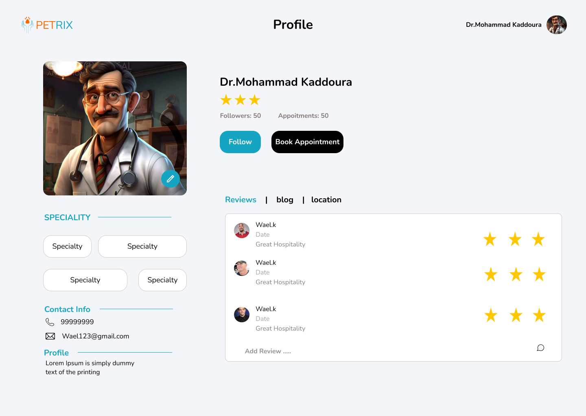 |

<br><br>

<!-- Implementation -->


> Using the wireframes and mockups as a guide, we implemented the PETRIX app with the following features:

### Pet Owner Screens (Web)
| AI Classification |  AI Assistant |
| ---| ---|
| 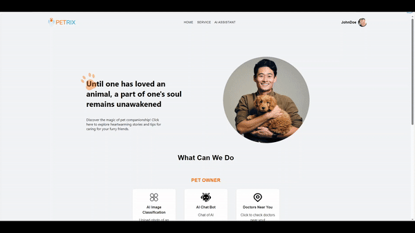 | 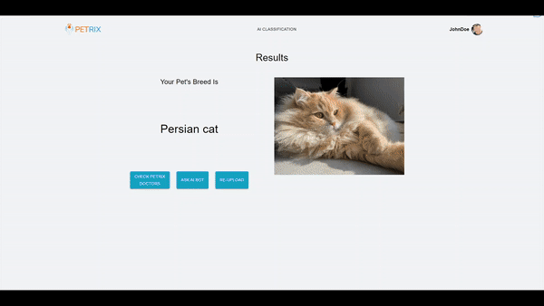 |
| Doctors Near You  |  Book Appointment |
| 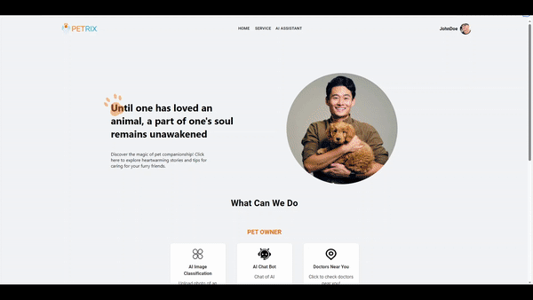 |  |


### Doctor Screens (Web)
| Register  | Handle Bookings |  Create Blog |
| ---| ---| ---|
| 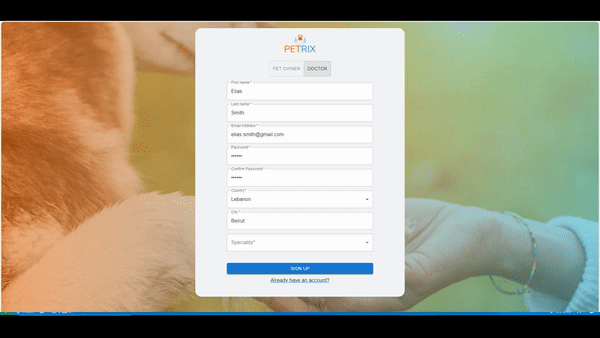 | 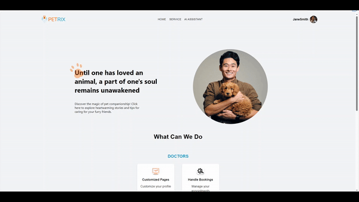 |  |

<br><br>

<!-- Tech stack -->


###  PETRIX is built using the following technologies:

- This project uses the [React Library](https://react.dev/) for the frontend development.
- [Express.js Framework](https://expressjs.com/) on [Node.js](https://nodejs.org/en) runtime environment for the backend server.
- [MySQL](https://www.mysql.com/) for the database. It is an open-source relational database management system.
- For the pet classificaiton, the app usese [Hugging Face Image Classification](https://huggingface.co/tasks/image-classification).
- [OpenAI](https://platform.openai.com/docs/libraries) was used to implement the AI Assistant.
- Google maps API was used for maps and clinic locations.
- To send local push notifications, the app uses the [Firebase cloud messaging](https://firebase.google.com/docs/cloud-messaging) which is a cross-platform cloud service for messages and notifications for Android, iOS, and web applications,

<br><br>

### Postman Collections
Collection to import: [PETRIX Postman collection](https://github.com/HassanMoussaa/Petrix-frontend/blob/main/PETRIX%20_Server.postman_collection.json)
🔖 How to use this collection

Step 1: Send requests
RESTful APIs allow you to perform CRUD operations using the POST, GET, PUT, and DELETE HTTP methods.
This collection contains each of these request types. Open each request and click "Send" to see what happens.

Step 2: View responses
Observe the response tab for status code (200 OK), response time, and size.

Step 3: Send new Body data
Update or add new data in "Body" in the POST request. Typically, Body data is also used in PUT request.

{
    "name": "Add your name in the body"
}

Step 4: Update the variable
Variables enable you to store and reuse values in Postman. We have created a variable called base_url with the sample request https://postman-api-learner.glitch.me. Replace it with your API endpoint to customize this collection.


<!-- How to run -->


> To set up PETRIX locally, follow these steps:


### Prerequisites (Windows)

- Node.js & npm
	1) Follow these instructions to setup Node.js: [Node.js Insrallation](https://docs.npmjs.com/downloading-and-installing-node-js-and-npm)


- MySQL
	1) Follow these instructions to setup MySQL: [MySQL Insrallation](https://www.w3schools.com/mysql/mysql_install_windows.asp)


### Installation (Windows)


1) Clone the frontend repo

   ```sh
   git clone https://github.com/HassanMoussaa/Petrix-frontend.git
   ```

2) Clone the backend repo

   ```sh
   git clone https://github.com/HassanMoussaa/Petrix-server.git
   ```
Backend repository: <a href="https://github.com/HassanMoussaa/Petrix-server">github.com/HassanMoussaa/Petrix-server</a>


3) Install NPM packages
    - You need to install the NPM packages in both the frontend & backend repositories
	- navigate to each repo and then run this command

   ```sh
   npm install
   ```

4) Setup the .env file in the backend file
	- Navigate to backend repo
	- Rename the file named ".env.example" to ".env"

5) Launch the server
	- Navigate to the server repo
	- Run this command	
	```sh
	npm start
	```

6) Launch the frontend
	- Navigate to the frontend repo
	- Run this command	
	```sh
	npm start
	```

Now, you should be able to run PETRIX locally and explore its features.
